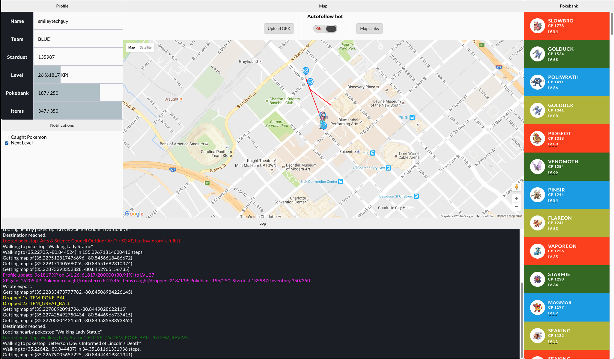
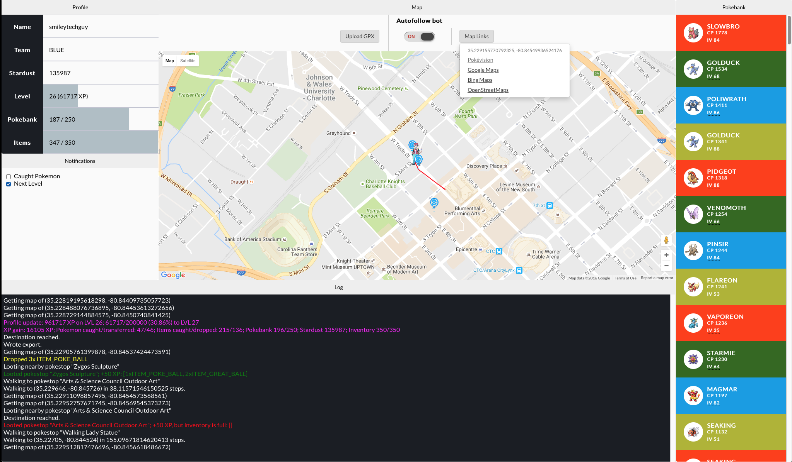
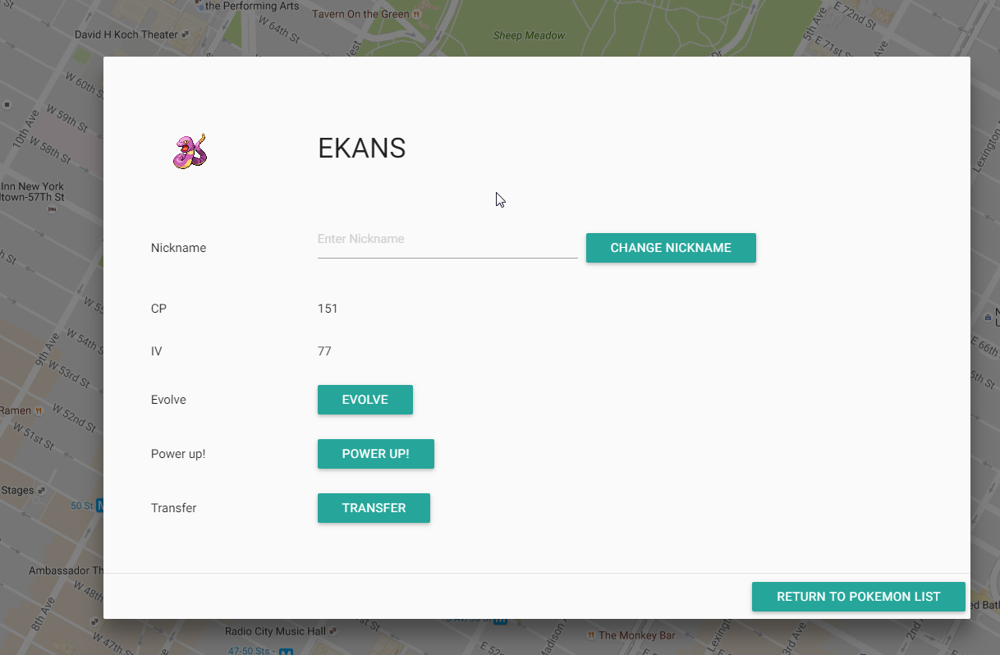

# Custom de-centralized GUIs

As a lot of people did not like the current web GUI, it is now de-centralized meaning that you can use anyone's GUI from the web!

## Creation

See DOCS.md for information on how to create a web-based GUI to share with others

## User-created GUIs

### [Theme from 0.5.0-alpha4 by @shilch](http://pogo.abb.ink/0.5.0-alpha4/map.html)

The original theme that comes with 0.5.0-alpha4

### [Better map toolbar by @smileytechguy](http://pogo.abb.ink/better-map/)

Original theme with map links on the toolbar, as well as easy coordinate access

### [Poppo by @pureexe](http://pogo.abb.ink/Poppo/)

More maps less data

### [TTL55 by @JoeyyT && Source from @pureexe](http://pogo.abb.ink/TTL55/)

More REST API and more FEATURES

**Please submit a PR if you want to add your GUI to this list**
**Pleace place the code in this branch, not on an external server**
